### Despliegue de función usando AZURE functions
____
#### Creando el proyecto en Visual Estudio
Para desarrollar la función he usado el IDE visual estudio.
He instalado el plugin de Azure para el mismo.

Una vez instalado el propio plugin solicita el inicio de sesión en Azure.

Desde el plugin creamos nuestro proyecto a través del icono de un directorio con un rayo.

El propio plugin solicita el directorio del proyecto a demás de:

- **Directorio del proyecto:** HashInsert
- **Plantilla de función:** HttpTrigger
- **Nombre de la función:** hashInsert
- **Nivel de autorización:** anonymous


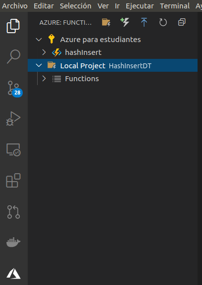

Posteriormente he instalado azure-functions-core-tools:

`npm i -g azure-functions-core-tools@3 --unsafe-perm true`

Mediante este paquete de herramientas podemos debuguear en local nuestra función y realizar el deploy desde el IDE.
____
#### Debug local y deploy

Para realizar un debug local de nuestro proyecto únicamente será necesario tener instalado el paquete azure-functions-core-tools.

Pulsamos F5 para comenzar a debuguear:

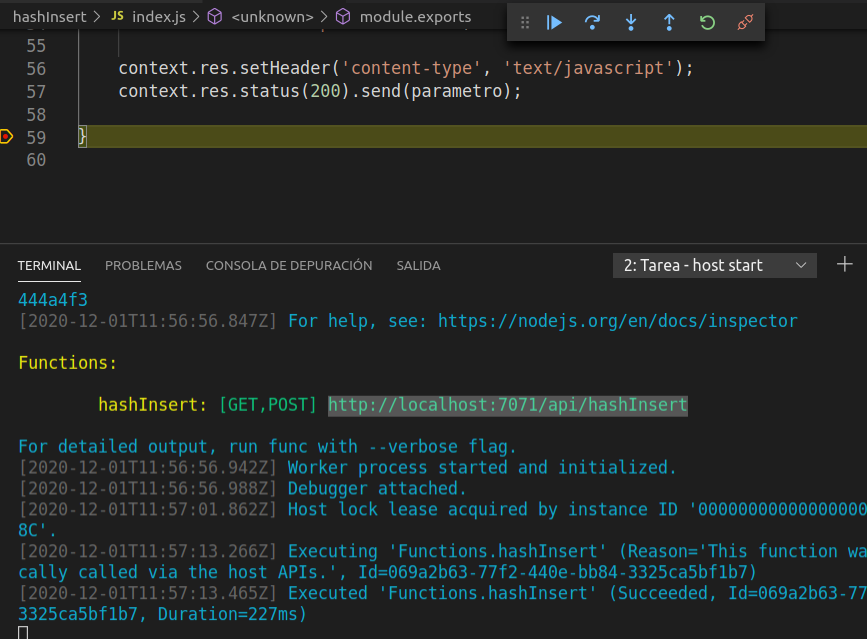

Accedemos a la URL local para verificar el funcionamiento de la función.

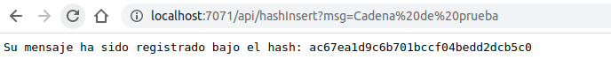

Una vez debugueada procedemos a hacer deploy haciendo clic en el botón con forma de flecha hacia arriba que aparece en el plugin de Azure.
El proyecto se subirá y ya estará disponible en Azure.

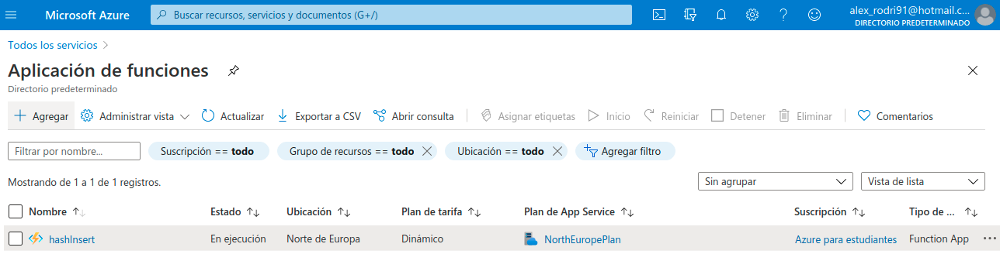

Nuestra función ya se encuentra en producción y es accesible desde el navegador [aquí](https://hashinsert.azurewebsites.net/api/hashInsert?msg=hola).

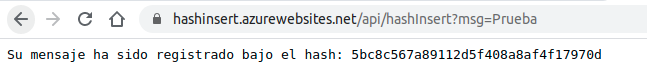
____
#### Peticiones desde el portal de Azure
También podemos comprobar el funcionamiento de la función generando peticiones http desde el propio portal de Azure.

Se genera una petición pasando el parámetro msg y el mensaje "Cadena"

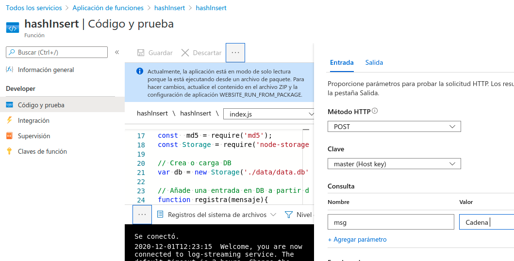

Se aprecia como la función registra la entrada de texto.

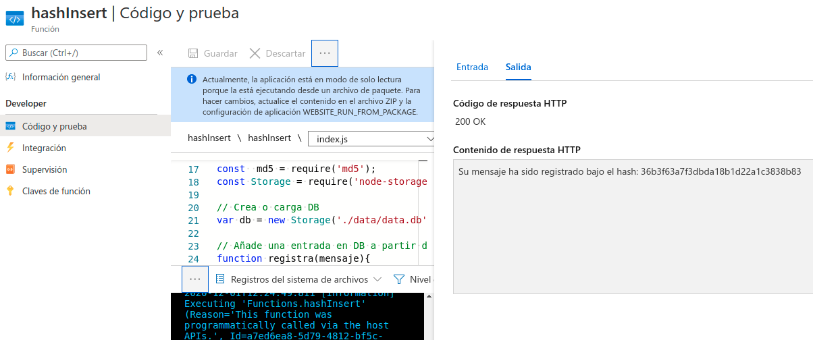


____
#### Autodeploy desde GitHub
Nuestra función ya se encuentra en producción desplegada en Azure, ahora queremos que esta se actualice y haga deploy de forma automática cuando actualicemos nuestro código. Para ello haremos uso de una función de GitHub denominada **Actions**

Para configurar el action seguiremos varios pasos:

- 1.Conseguir el perfil público de nuestra función.
- 2.Guardar el perfil público de nuestra función como un SECRETS de GitHub
- 3.Crear Workflow

##### Perfil público
Podemos descargarlo haciendo clic en *obtener perfil de publicación* en la pantalla principal de nuestra función. 
Contiene toda la información necesaria para la publicación de la función.

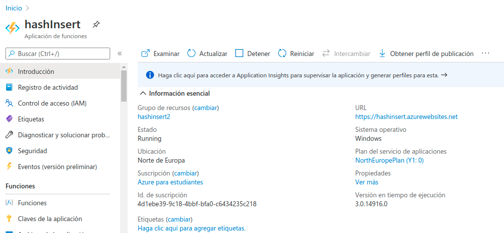

##### Crear un nuevo SECRETS en GitHub
Los SECRETS de GitHub nos permiten almacenar información confidencial que será accedida como una variable de entorno.

Para permitir que GitHub pueda lanzar un deploy de nuestra función en Azure será necesario proporcionarle todo el contenido del perfil de publicación.

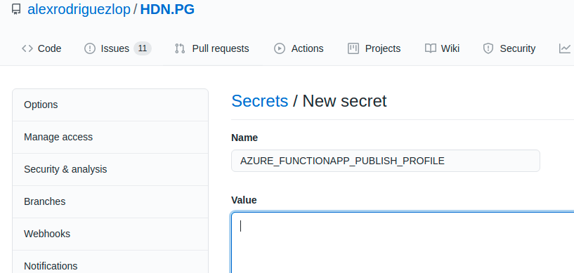

Insertaremos todo el contenido del perfil de publicación en el campo value.

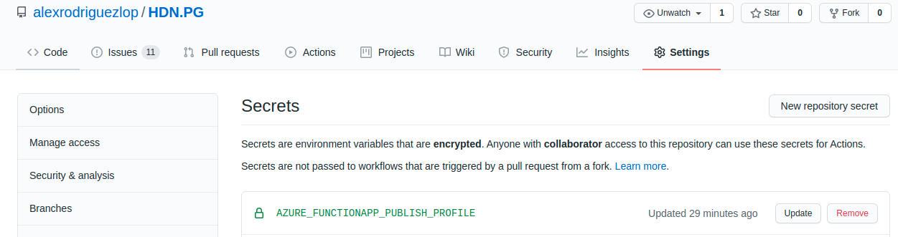

##### Workflow

Una vez creado todo esto ya podemos crear el fichero YAML que contendrá el action azure-function.yml y lo guardaremos en *.github/workflows*.


```
name: Deploy Node.js project to Azure Function App
on:
  [push]
env:
  AZURE_FUNCTIONAPP_NAME: HashInsertDT    
  AZURE_FUNCTIONAPP_PACKAGE_PATH: './HashInsertDT'      
  NODE_VERSION: '14.x'                   

jobs:
  build-and-deploy:
    runs-on: ubuntu-latest
    steps:
    - name: 'Checkout GitHub Action'
      uses: actions/checkout@master

    - name: Setup Node ${{ env.NODE_VERSION }} Environment
      uses: actions/setup-node@v1
      with:
        node-version: ${{ env.NODE_VERSION }}

    - name: 'Resolve Project Dependencies Using Npm'
      shell: bash
      run: |
        pushd './${{ env.AZURE_FUNCTIONAPP_PACKAGE_PATH }}'
        npm install
        npm run build --if-present
        npm run test --if-present
        popd
    - name: 'Run Azure Functions Action'
      uses: Azure/functions-action@v1
      id: fa
      with:
        app-name: ${{ env.AZURE_FUNCTIONAPP_NAME }}
        package: ${{ env.AZURE_FUNCTIONAPP_PACKAGE_PATH }}
        publish-profile: ${{ secrets.AZURE_FUNCTIONAPP_PUBLISH_PROFILE }}
```

Este fichero es un [modelo](https://github.com/Azure/actions-workflow-samples/blob/master/FunctionApp/linux-node.js-functionapp-on-azure.yml) proporcionado por el propio Azure en el cual únicamente he tenido que establecer el valor de las constantes iniciales:

  - **AZURE_FUNCTIONAPP_NAME:** HashInsertDT    *Nombre de mi función*
  - **AZURE_FUNCTIONAPP_PACKAGE_PATH:** './HashInsertDT'      *Directorio del proyecto*
  - **NODE_VERSION:** '14.x'   *Versión de node*
  
  Este fichero establece tres tareas:
  
  - Instalar node
  - Ejecutar las ordenes npm
 	 -  npm install
  - Deploy en Azure

Las cuales se lanzan cuando hagamos un PR, ya que así lo especifica la orden **on push**.

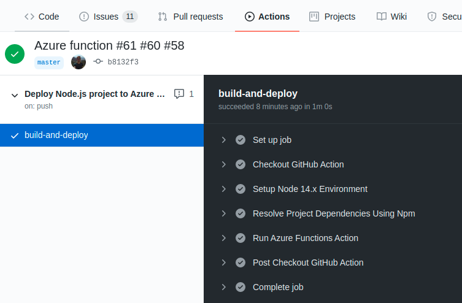

Aquí se pueden ver todos los [action del repositorio](https://github.com/alexrodriguezlop/HDN.PG/actions).
  
____
#### Función
La función hace uso de dos librerías externas denominadas [md5](https://www.npmjs.com/package/md5) y [node-storage](https://www.npmjs.com/package/node-storage).
La librería **md5** proporciona la función hash que se aplica sobre la cadena de texto mientras la función **node-storage** proporciona un sistema de persistencia para los registros.

El sistema tendrá una estructura de la siguiente forma:

```
"hash": "098f6bcd4621d373cade4e832627b4f6",
"fecha": "22-9-2020",
"hora": "15:00"
```


##### Función registra
Esta función ha sido desarrollada para simplificar a la función handler.
Es la encargada de realizar el registro correspondiente a un mensaje añadiendo una entrada de fecha y hora para una clave hash y devolviendo la misma si todo el proceso ha ido bien.

```
function registra(mensaje){
    var now = new Date();

    var hora = now.getHours() + ":" + now.getMinutes();
    var fecha = now.getDate() + '-' + now.getMonth() + '-' + now.getFullYear();

    var hash = md5(mensaje);
    var obj = {
        "fecha":fecha,
        "hora": hora
    }

    // Inserta clave , valor
    db.put(hash, obj);

    var result = hash;
    return result; 
}
```
##### Función manejadora
Esta función recibe la petición, extrae el parámetro (será el mensaje) y lo proporciona a la función registra. 

```
module.exports = (context, req) => {
    //Captamos el parámetro
    var parametro = req.query.msg;
    
    if(parametro != null)
        result = "Su mensaje ha sido registrado bajo el hash: " + registra(parametro);
    else
        result = "No se pudo insertar";

    context.res.setHeader('content-type', 'text/javascript');
    context.res.status(200).send(result);
    
}
```


##### Código completo
```
const  md5 = require('md5');
const Storage = require('node-storage');

// Crea o carga DB
var db = new Storage('./data/data.db');

// Añade una entrada en DB a partir de una cadena
function registra(mensaje){
    var now = new Date();

    var hora = now.getHours() + ":" + now.getMinutes();
    var fecha = now.getDate() + '-' + now.getMonth() + '-' + now.getFullYear();

    var hash = md5(mensaje);
    var obj = {
        "fecha":fecha,
        "hora": hora
    }

    // Inserta clave , valor
    db.put(hash, obj);

    var result = hash;
    return result; 
}

//https://hashinsert.azurewebsites.net/api/hashInsert?msg=
// Función principal manejadora de petición
module.exports = (context, req) => {
    //Captamos el parámetro
    //var parametro = req.query["msg"];
    //const parametro = (req.query.msg || (req.body && req.body.msg));
    var parametro = req.query.msg;
    
    if(parametro != null)
        result = "Su mensaje ha sido registrado bajo el hash: " + registra(parametro);
    else
        result = "No se pudo insertar";

    context.res.setHeader('content-type', 'text/javascript');
    context.res.status(200).send(result);
    
}
```