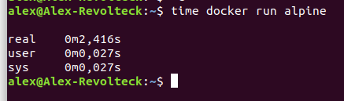

## Eligiendo el Docker adecuado

### Por donde empezar.
He comenzado realizando una busqueda en la plataforma [docker](https://hub.docker.com/).

He encontrado dos versiones que corresponden con lo que busco.

- Versión  [oficial](https://hub.docker.com/u/nodesource) de nodesource, 
- [alpine](https://hub.docker.com/_/alpine) una versión muy ligera de linux, solo 5MB 

He medido el tiempo que tarda cada una de ellas en levantarse.

Como se puede apreciar en la imagenes [alpine](https://hub.docker.com/_/alpine) ha sido mas rapida y juega con la ventaja de que su tamaño es muy reducido.

Ademas de ser una versión oficial, lo que nos proporciona garantias de seguridad y versiónes actualizadas.

