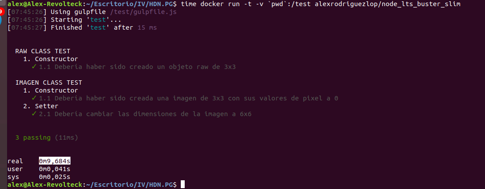

## Eligiendo el Docker adecuado

Medicion del built
`time docker build -t alexrodriguezlop/tag .`

Medicion del run
`time docker run -t -v `pwd`:/test alexrodriguezlop/tag `

#### Comparativa:
| **Versión** | **Tiempo Build** | **Tiempo Run** | **Tamaño** | **Descripción**|
| -- | -- | -- | -- | -- |
|node:lts-alpine3.12 | 1m33,689s | 0m14,055s | 168MB | Alpine 3.12 y Node:14.15 |
|node:lts-buster | 1m32,570s | 0m10,525s | 1GB |  Node:14.15 |
|node:lts-buster-slim| 1m47,808s| 0m9,684s | 265MB |  Node:14.15 | 
|node:lts-stretch | 2m41,508s| 0m12,411s | 1.02GB | Node:14.15 |
|node:lts-stretch-slim | 1m48,063s | 0m8,462s | 244MB |Node:14.15|

## node:lts-alpine3.12

## node:lts-buster

## node:lts-buster-slim

## node:lts-stretch

## node:lts-stretch-slim

## Tamaños

Teniendo en cuenta la comparativa de tiempos he elegido entre **node:lts-buster-slim** y **node:lts-stretch-slim** decidiendome por **node:lts-stretch-slim**.
No es la más rapida a simple vista pero es la que tiene un mejor equilibrio entre sus tiempos y se encuentra entre las de menor tamaño.

He intentado que la imagen cumpla con una serie de requisitos:
- Propósito único y bien definido
- Diseño genérico con la capacidad de inyectar configuración en tiempo de ejecución
- Tamaño pequeño
- Fácil de entender

He optimizado la imagen reduciendo el tamaño de su capa ajustando las instrucciones de RUN.

Al final de cada instrucción RUN docker confirma los cambios como una capa de imagen adicional.
Con lo cual a menos instrucciones RUN, menos capas y menos peso.

Si en algún momento fuera necesario el cambio de imagen bastaría con editar la linea **FROM** del *dockerfile* y esta se reconstruiria automaticamente en dockerhub.