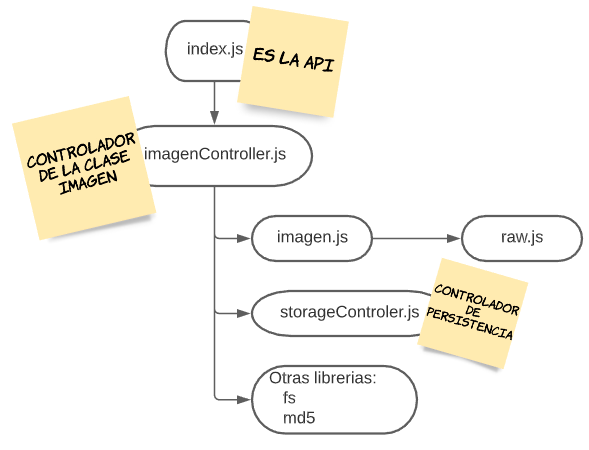
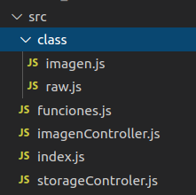

### Diseño y estructura de la api

He mantenido un diseño estructurado respetando las responsabilidades de cada capa de la aplicación.

La carpeta **src** contiene todo el código fuente de la api.
Dentro encontramos una segunda carpeta denominada **class** que contiene las clases del proyecto.

Las clases del proyecto son dos:

-  [**Raw**](https://github.com/alexrodriguezlop/HDN.PG/blob/master/src/class/raw.js)
-  [**Imagen**](https://github.com/alexrodriguezlop/HDN.PG/blob/master/src/class/imagen.js)

**Raw** es la clase que realiza el manejo de la imagen en el ámbito de bits.
 
Básicamente contiene un buffer y los métodos necesarios para realizar operaciones sobre sus bytes a bajo nivel (bit a bit).

**Imagen** es la clase que representa a una imagen.
Contiene la información de la imagen y un objeto de la clase Raw que representa la matriz de píxeles.

Entre ambos se establece una jerarquía de llamadas.

Sobre ambos trabajan los controllers.

- [**imagenController**](https://github.com/alexrodriguezlop/HDN.PG/blob/master/src/imagenController.js)

- [**storageControler**](https://github.com/alexrodriguezlop/HDN.PG/blob/master/src/storageControler.js)

**imagenController** Es una capa de abstracción sobre la clase Imagen. 

Es la interfaz que permite crear objetos de esta clase y manipularlos. 

Dispone de funciones para leer la imagen y sus metadatos.

**storageControler** Es una capa de abstracción para la persistencia de datos.

Esta interfaz permite guardar y recuperar datos haciendo uso de la persistencia.
