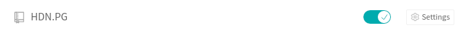
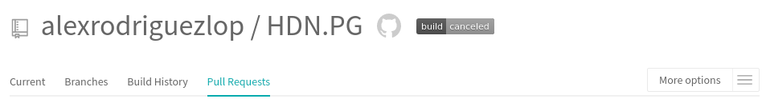
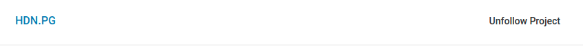
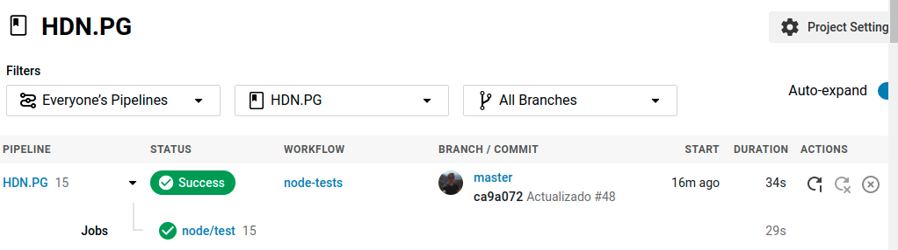

## Integración continua

### Usando Travis
Bastará con seguir los siguientes pasos:

- 1. Crear una cuenta en Travis. (Podemos usar la cuenta de GitHub)
- 2. Darle permisos a travis 
- 3. Activar travis en el repositorio
- 4. Crear el fichero travis.yml
- 4. Integrar el badge en nuestro README
  
 


 


 

Para utilizar nuestro docker he incluido las siguientes lineas: 

```
language: node_js
services:
  - docker
before_install:
  - docker pull alexrodriguezlop/hdn.pg
script:
  - docker run -t -v 'pwd':/test alexrodriguezlop/hdn.pg
notifications:
  email:
    recipients:
      - alexrodriguezlop@gmail.com
    on_success: never 
    on_failure: always 
```
**before_install:**
Descargamos la imagen

**script:**
Ejecutamos la imagen

En notificaciones lo configuro de modo que solo me avise via e-mail en caso de fallo.

### Usando CIrcleCI
Su configuración es muy similar a la de travis:

- 1. Crear una cuenta en CircleCI. (Podemos usar la cuenta de GitHub)
- 2. Darle permisos a CircleCI 
- 3. Seguir a CircleCI en el repositorio
- 4. Crear el fichero config.yml dentro la carpeta .circleci
- 4. Integrar el badge en nuestro README siguiendo su [guía](https://circleci.com/docs/2.0/status-badges/).

 


 


```
version: 2.1
jobs:
  build:
    docker:
      - image: alexrodriguezlop/hdn.pg
    working_directory: ~/repo

    steps:
      - checkout
      - run: gulp test
```

**Autor:** Alejandro Rodríguez López

[Volver](https://github.com/alexrodriguezlop/HDN.PG)