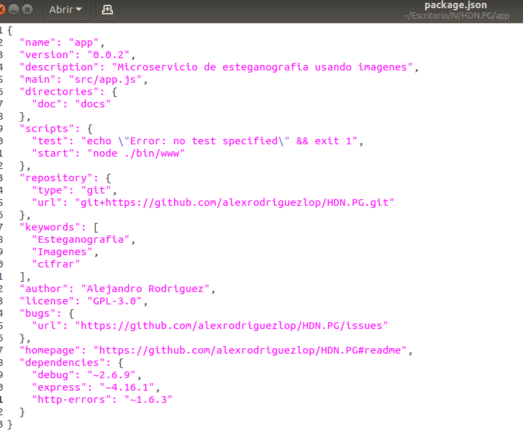
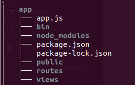
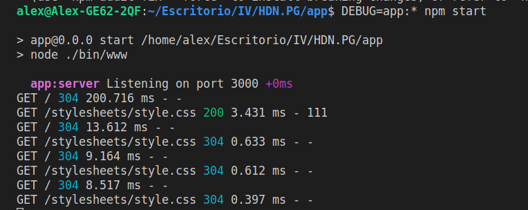

### Primeros pasos de HDN.PG

#### Instalando Node:
[Node.js](https://nodejs.org/es/) es un motor que permite ejecutar código javascript en una maquina sin la necesidad de que este sea interpretador por un navegador.

[Instalación en Ubuntu](https://github.com/nodesource/distributions/blob/master/README.md#debinstall)

#### Primeros pasos con Express:
[Express](https://expressjs.com) es un framework para el desarrollo de microservicios usando node.js.

Los [primeros pasos](https://expressjs.com/es/starter/installing.html) se encuentran indicados en su manual.

Una vez instalado node.js podemos crear un servicio bási cocreando el fichero *package.json*

`$ npm init`

Su configuración ha quedado de la siguiente forma:

  

Posteriormente he ejecutado la utilidad [generador express](https://expressjs.com/es/starter/generator.html) la cual ha creado una estructura de directorios que he adaptado a mis necesidades. 

Para ello: 

 

Es muy probable que todavía ajuste un poco los ficheros de las clases. Aunque en un principio he decidido utilizar una clase *imagen.js* y un módulo *cifrado.js*

**cifrado** 
Recibirá una imagen y devolverá una nueva imagen generada aplicando las técnicas de esteganografía sobre la primera y una cadena de texto.

**Imagen**
Será el objeto en que se codifique la imagen cargada en el microservicio para posteriormente operar sobre ella. 

Resumen de los pasos a seguir:
**1)** 

### Funciona!
Primera prueba:

 

