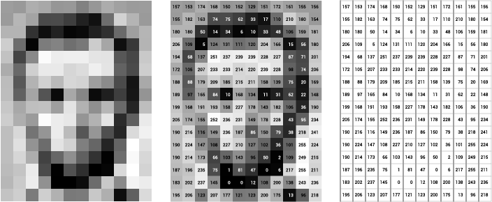

# [HDN.PG](https://github.com/alexrodriguezlop/HDN.PG)
Microservicio para el cifrado y descifrado de mensajes en imágenes.

 

## Hablemos de esteganografía
La esteganografía es el arte de ocultar información.

En este [Artículo de xataka](https://www.xataka.com/historia-tecnologica/cuando-una-imagen-oculta-mas-informacion-de-lo-que-parece-que-es-y-como-funciona-la-esteganografia) se trata el tema desde sus orígenes hasta la actualidad.

También podemos dar una vuelta por [wikipedia](https://es.wikipedia.org/wiki/Esteganograf%C3%ADa) para saber un poco más del asunto.

El microservicio se centrará en la ocultación de información dentro de imágenes utilizando una técnica que consiste en la inserción de información en el [bit menos significativo](https://es.wikipedia.org/wiki/Bit_menos_significativo) de cada píxel. 

Entendiendo que una imagen es una matriz de píxeles numéricos que proporcionan información de cada píxel como su color, etc..

 

## Paquetes necesarios
[Gulp](https://gulpjs.com/) es un automatizador de tareas, similar a makefile que permite establecer ordenes agrupadas bajo una única orden.

`npm -g install gulp`

[Express](https://expressjs.com/en/starter/generator.html) en un framework ligero y sencillo para la creación de servicios usando javascript.

`npm install express --save`

