# HashFinderDT
Busca en una lista cuando se cifró el mensaje usando la función hash sobre el texto.

[Acceso al BOT @H20DTbot](https://t.me/H20DTbot)
____
#### Creando el proyecto, Vercel
En primer lugar elegimos la fuente del código:

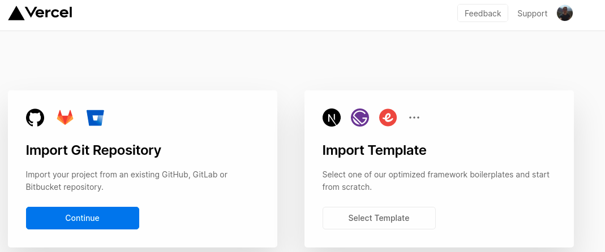

Elegimos nuestro repositorio:

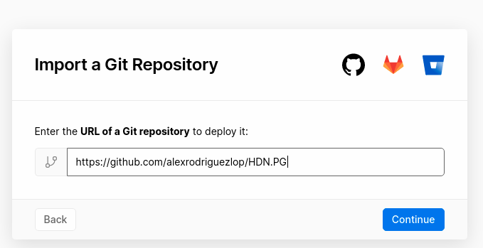

Indicamos la carpeta donde se encuentra el proyecto dentro de nuestro repositorio:

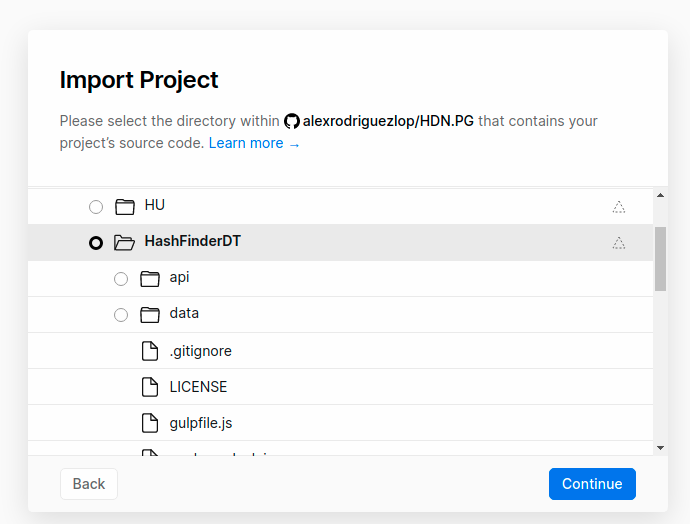

Establecemos un nombre para el proyecto:

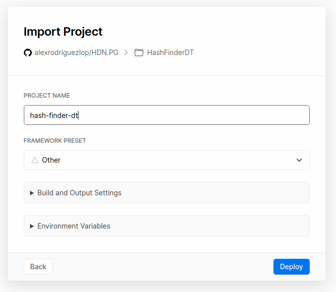

Nuestra función está lista.
Ya que Vercel se conecta a GitHub y hace el deploy de nuestra función de forma automática en cada PR.

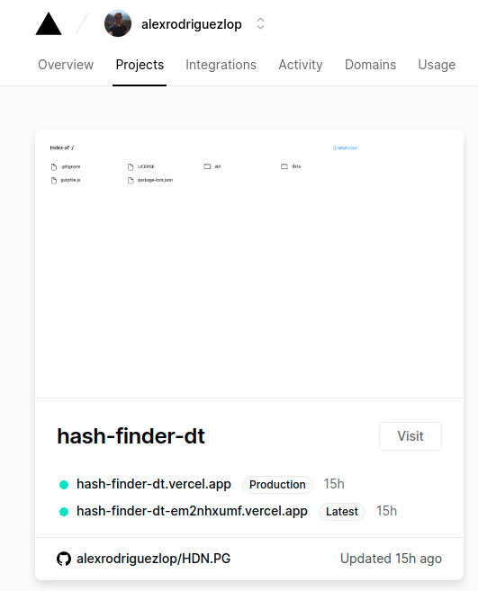

Para evitar recibir un email en cada deploy he creado el fichero **vercel.json** añadiendo lo siguiente:

```
{
  "github": {
    "silent": true
  }
}
``` 

_____
#### Desarrollo:

**@BotFather**
El primer paso para crear nuestro bot se realiza con Telegram.
Haremos uso de **@BotFather**.
El será el encargado de guiarnos en la creación de nuestro bot usando la orden **/newbot**.

Nos solicitará que elijamos un nombre y un nombre de usuario para nuestro bot. 


Cuando terminemos este proceso **@BotFather** nos proporcionará el token de nuestro bot. 
**Importante** mantenerlo a salvo, ya que es la clave que nos permite el control sobre nuestro bot.

Posteriormente desde **@BotFather** podemos establecer otros parámetros de nuestro bot como la privacidad, la imagen del bot, la descripción, los comandos, etc.

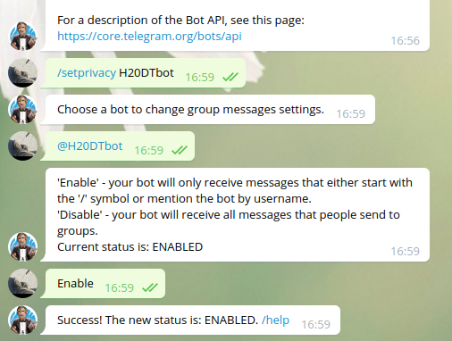

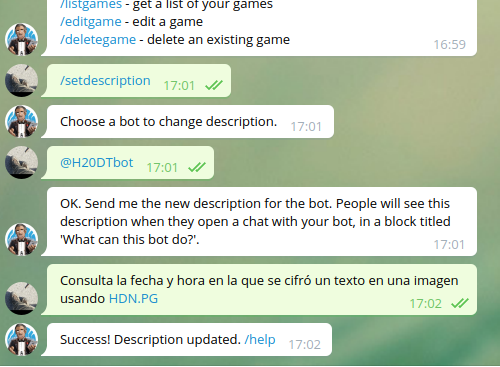

Podemos comprobar que el bot recibe mensajes usando CURL:

```
curl -X POST "https://api.telegram.org/botTOKEN/sendMessage" -d "chat_id=**440**&text=Prueba"
```

Una vez terminado todo lo anterior vamos a establecer el **webhook**, para ello accederemos a la siguiente url utilizando la función **setWebhook**:

```
https://api.telegram.org/botTOKEN/setWebhook?url=https://hash-finder-dt.vercel.app/api/appBot

```
La respuesta será:

```
{"ok":true,"result":true,"description":"Webhook is already set"}
```

____
#### Código

##### Función obtener

La función hace uso de una libreria externa denominada [md5](https://www.npmjs.com/package/md5).
La librería **md5** proporciona la función hash que se aplica sobre la cadena de texto.

Esta función ha sido desarrollada para simplificar a la función handler.
Es la encargada de realizar la búsqueda correspondiente a un mensaje mediante su hash.

El bot utiliza un fichero llamado data.json para recuperar los registros.

El fichero tendrá una estructura de la siguiente forma:

```
"hash": "098f6bcd4621d373cade4e832627b4f6",
"fecha": "22-9-2020",
"hora": "15:00"
```

```
const data = require("../data/data.json" )
const  md5 = require('md5');


// Extrae una tupla del fichero JSON a partir de una clave hash 
function obtener(valor){
  var result = null;

  for(var i = 0; i < data.lista.length; i++){
    if(data.lista[i].hash === valor)
     result = data.lista[i];
  }
  return result;
}
```

##### Función handle
Para llevar a cabo la comunicación necesitamos una serie de datos:

- **chatID:** Identifica el chat al que irá dirigida la respuesta.
- **msgID:** Identifica el mensaje dentro del chat al que estamos contestando.
- **cadena:** Extrae todo lo que el usuario a escrito desde el chat.
 	- **arg:** Comando extraído de cadena.
 	- **clave:** Clave extraída de cadena.

He encontrado problemas ante la posibilidad de que el usuario edite un mensaje, ya que en dicho caso el contenido de **req** cambia.
Con lo que para poder solventar dicha situación accedo a la información contenida en **req** con una ruta distinta dependiendo de si es o no un mensaje editado siguiendo la siguiente lógica:

```
  var chatID, msgID, mensaje, telegramRes, cadena, arg, clave;
  
  if(req.body.message != undefined){
    chatID = req.body.message.chat.id;
    msgID = req.body.message.message_id;
    cadena = req.body.message.text;
  }
  else{
    chatID = req.body.edited_message.chat.id;
    msgID = req.body.edited_message.message_id;
    cadena = req.body.edited_message.text;
  }

  arg = cadena.slice(0, 7).toLowerCase(); //Orden
  clave = cadena.slice(8, cadena.length); //Mensaje
	
```


Para determinar el comportamiento utilizo en switch case en el cual cada caso dependerá del argumento y generará un mensaje diferente que posteriormente será integrado en una estructura que será devuelta.


```
 switch(arg) {
    // /BUSCAR
    case '/buscar':
      if(clave != ''){
        var result = obtener(md5(clave));
  
        if(result === null){
          mensaje = '\u{2716} *Su mensaje no ha sido cifrado y por tanto no hay registros*';
        }
        else{
          mensaje = '\u{1F4C6} *Fecha:* ' + result.fecha + ' \u{231A} *Hora:* ' + result.hora;
        }
      }
      else{
        mensaje = '\u{1F605} *No ha introducido el texto a buscar!* ';
      }
      break;
    // /HELP
    case '/help':
      mensaje = '\u{1F50D} Para buscar use la orden */buscar* seguida del texto.  \u{27A1} *Ejemplo:* /buscar test';
      break;
    // Otro caso    
    default:
      mensaje = '\u{26A0} Comando desconocido, use */help*';
  }
```
Una vez ya ha sido generado el mensaje correspondiente a la acción del usuario generaremos una estructura que será interpretada por telegram:

```
  telegramRes = {
    text:mensaje, 
    method:"sendMessage", 
    chat_id:chatID, 
    reply_to_message_id: msgID, 
    parse_mode: 'Markdown'
  };

```
Dicha estructura contendrá:

- **text:** Contendrá el mensaje generado en función a la solicitud, es decir la respuesta. 
- **method:** Contendrá el método a utilizar por la api de telegram, en este caso **sendMessage**. 
- **chat_id:** Contendrá el identificador del chat al que va dirigida la respuesta. 
- **reply_to_message_id:** Contendrá el identificador del mensaje al que estamos respondiendo. 
- **parse_mode:** Contendrá la forma en que se debe interpretar el mensaje, en este caso **Markdown**.

La estructura será enviada como un objeto **JSON**.
Para ello debemos establecer el tipo en la cabecera:

`res.setHeader("Content-Type","application/json");`
  
 Posteriormente estableceremos el estado de la solicitud como 200 (Exitoso) y adjuntaremos el objeto json a **res**.
 En dicho caso usaremos `.json()` en lugar de `.send()`.
  
`res.status(200).json(telegramRes);`


Aquí podemos ver una captura del log donde se editaba un mensaje.
La captura muestra el contenido de dos rutas:
 `req.body.edited_message.message_id` y  `req.body.message.message_id`.
Se aprecia como una de ellas es indefinida.
El error se producía cuando se intentan extraer los datos de la ruta indefinida.

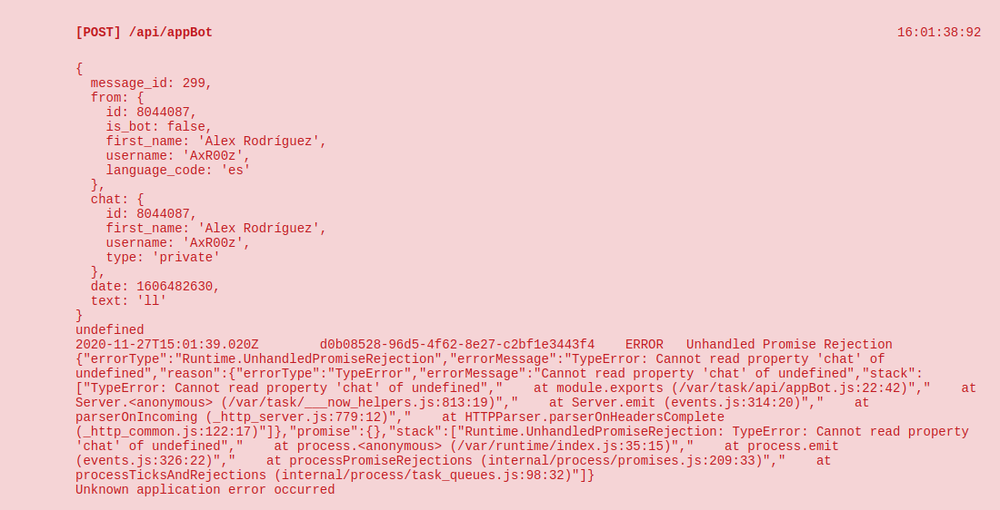

Para el uso de Emoji se ha usado esta [URL](https://apps.timwhitlock.info/emoji/tables/unicode)


____
#### Uso:

Ejemplo:
>Si ciframos el texto *supercalifragilisticoespialidoso* en algún momento, podremos saber posteriormente cuando se cifró proporcionando el texto exacto a la orden **/buscar**

> **/buscar** supercalifragilisticoespialidoso


**Ejemplo de uso:**

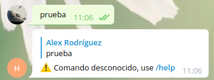

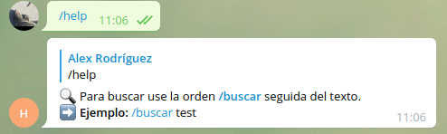


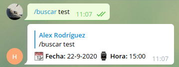


