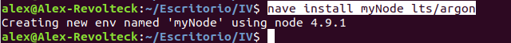
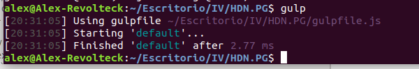
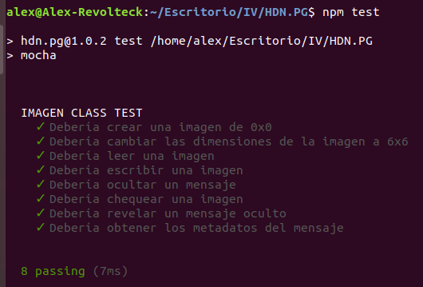

Testeo y automatización - Primeros pasos:
---
### NAVE
Utilizaré un entorno vistual, de modo que si en algún momento necesito probar una combinación de versiones de paquetes diferente podría crear un nuevo entorno sin alterar el existente.

Instalación del entorno virtual [NAVE](https://www.npmjs.com/package/nave):

`sudo npm install -g nave`

Creando un entorno llamado myNode con la versión LTS argon:

`nave install myNode lts`

 

Para usar el entorno:

`nave use myNode`

Después de la ejecución de este comando se utilizarán los paquetes y versiones que hayan sido instalados previamente en el.

---
### GULP
Instalación de [GULP](https://gulpjs.com/docs/en/getting-started/quick-start) para automatización de tareas:

`npm install --global gulp-cli`

Posteriormente creariamos el fichero *package.json* 
podemos crearlo usando la oredn:

`npm init`

que lanzará un asistente, una vez creado incorporariamos *gulp* en la lista de dependencias de nuestro proyecto:

`npm install --save-dev gulp`

El fichero *package.json* quedaría así:

```
{
  "name": "hdn.pg",
  "version": "1.0.2",
  "description": "Microservicio de esteganografia usando imagenes",
  "main": "src/class/imagen.js",
  "directories": {
    "doc": "docs"
  },
  "scripts": {
    "test": "mocha",
    "start": ""
  },
  "repository": {
    "type": "git",
    "url": "git+https://github.com/alexrodriguezlop/HDN.PG.git"
  },
  "keywords": [
    "Esteganografia",
    "Imagenes",
    "cifrar"
  ],
  "author": "Alejandro Rodriguez",
  "license": "GPL-3.0",
  "bugs": {
    "url": "https://github.com/alexrodriguezlop/HDN.PG/issues"
  },
  "homepage": "https://github.com/alexrodriguezlop/HDN.PG#readme",
  "dependencies": {},
  "devDependencies": {
    "gulp": "^4.0.2"
  }
}
```
si nos fijamos se ha incorporado la versión de *gulp*

Ahora vamos a crear un *gulpfile*.

```
function defaultTask(cb) {
    // Tareas previas a la llamada a función
    cb();
  }
  
  // Define que tarea será la tarea por defecto
  exports.default = defaultTask
```
Para probarlo ejecutaremos la orden:

`gulp`

 

---
Instalando [MOCHA](https://mochajs.org/) para test:

`npm install --save-dev mocha`

una vez instalada mocha crearemos el directorio *test* y el fichero *test.js*.

Añadimos mocha al fichero *pacakage.json*:

` "scripts": {
    "test": "mocha",`

Creamos un test unitario para testear la clase.


---
### Funcionamiento de test:

 