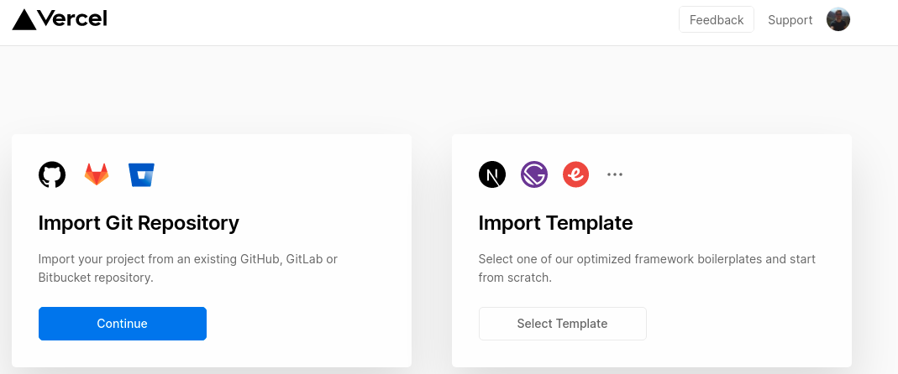
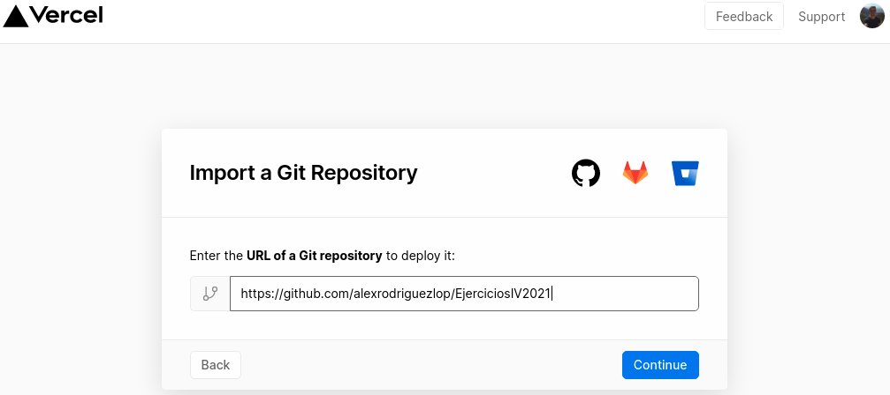
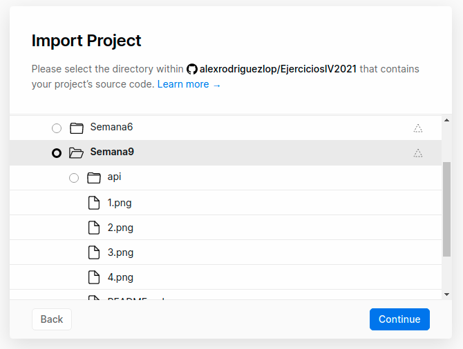
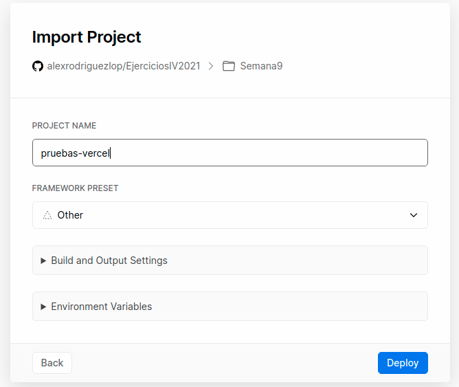
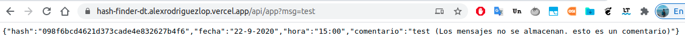

### Despliegue de una función usando vercel:

**Código:**

En primer lugar he creado una función para buscar dentro de un fichero JSON:

```
function obtener(valor){
  var result = null;

  for(var i = 0; i < data.lista.length; i++){
    if(data.lista[i].hash === valor)
     result = data.lista[i];
  }
  return result;
}
```
después he creado una función manejadora:

```
module.exports = (req, res) => {
   // Captamos el parámetro
  var parametro = req.query["msg"];

  if(parametro != null){
    result = obtener(md5(parametro));
    if(result === null){
      res.status(404).send("No se encontró."); 
    }
    else{
      res.status(200).send(result);
    }
  }
  else {
    res.status(400).send('Formato incorrecto, PRUEBE:?msg="test".');
  }
}

```
En dicha función se extrae el contenido del parámetro **msg** de la url `var parametro = req.query["msg"];`.

A continuación si tiene contenido se busca dicho contenido en el fichero json.

Tras una estructura IF-ELSE se valorán las siguientes situaciones:

- **Encontrado:** Se ha encontrado y se devuelve.
- **No encontrado:** Se genera un mensaje que informa de que no ha sido encontrado.
- **Formato incorrecto:** Se genera un mensaje que informa de que los parámetros en la URL no son correctos.


**Código completo:**
```
const data = require("../data/data.json" )
const  md5 = require('md5');


// Extrae una tupla del fichero JSON a partir de una clave hash 
function obtener(valor){
  var result = null;

  for(var i = 0; i < data.lista.length; i++){
    if(data.lista[i].hash === valor)
     result = data.lista[i];
  }
  return result;
}

// Función principal manejadora de petición
module.exports = (req, res) => {

  
   // Captamos el parámetro
  var parametro = req.query["msg"];

  if(parametro != null){
    result = obtener(md5(parametro));

    if(result === null){
      res.status(404).send("No se encontró."); 
    }
    else{
      res.status(200).send(result);
    }
    
  }
  else {
    res.status(400).send('Formato incorrecto, PRUEBE:?msg="test".');
  }
}

```
**Vercel:**
He utilizado la explicación de los ejercicios anteriores, ya que el proceso no difiere.

Importamos el repositorio de GitHub:



En este caso nbuestro repositorio sería [HashFinderDT](https://github.com/alexrodriguezlop/HashFinderDT).



Importamos el proyecto especificando donde se encuentran los ficheros fuente.

Si nuestro proyecto dispone de ficheros complementarios y estos se encuentran en la raíz del directorio especificaremos dicho directorio.

En este caso nuestra función se encuentra en el directorio **api**



Establecemos los parámetros básicos de configuración para nuestro proyecto.

En este caso particular solo hemos proporcionado un nombre.



Para evitar recibir un email en cada deploy he creado el fichero **vercel.json** añadiendo lo sieguiente:

```
{
  "github": {
    "silent": true
  }
}
``` 

Verificamos que el [despliegue](https://hash-finder-dt.alexrodriguezlop.vercel.app/api/app?msg=test) ha sido correcto y la función funciona:

 

Devolverá la tupla correspondiente a la clave buscada en el fichero json:
```
{
"hash":"098f6bcd4621d373cade4e832627b4f6",
"fecha":"22-9-2020",
"hora":"15:00",
"comentario":"test (Los mensajes no se almacenan. esto es un comentario)"}
```

