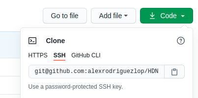
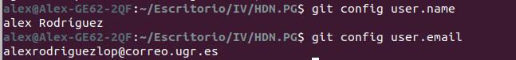
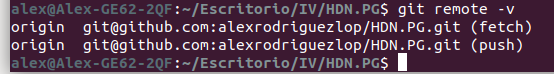
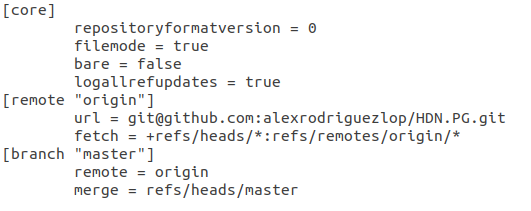
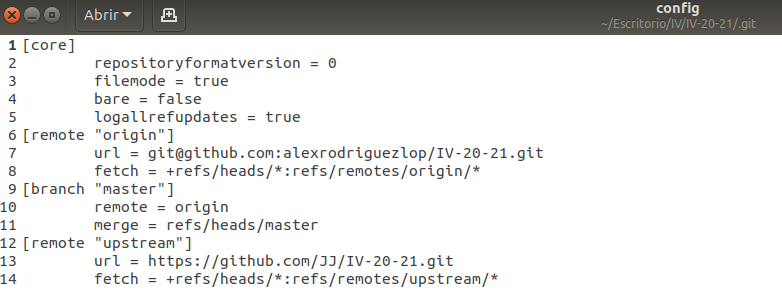
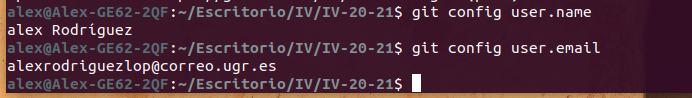

## Configuración de GitHub y del repositorio.

### Por donde empezar
Comenzaremos instalando un cliente de GitHub en nuestro ordenador.

`sudo apt-get install git`

Actualmente existe uno mas moderno que permite funcionalidad sobre los issues, aunque a mi personalmente me gusta **git** este el otro se llama **gh** lo podemos instalar de la siguiente forma.

`sudo apt install gitsome`

Una vez instalado el cliente ya podemos clonar el repositorio aunque antes deberíamos configurar un par de claves para evitar tener que logearnos a cada instante mientras trabajamos desde el CLI.

En mi caso ya las tenia creadas de antes.
Si fuera necesario rehacerlo dejo una guía:

[Guía para Configurar las claves en GitHub](https://medium.com/@ancizj393/crear-una-clave-ssh-en-git-y-vincular-en-tu-cuenta-de-github-e7a6b22bc93f)

Una vez configuradas nuestras claves podemos clonar el repositorio.

 

`git clone git@github.com:alexrodriguezlop/HDN.PG.git`

Una vez completado el paso anterior vamos a proceder a configurar algunos parámetros del repositorio:

Establecer nombre y email en el repositorio:

`git config user.name "Alex Rodríguez"`

`git config user.email "alexrodriguezlop@correo.ugr.es"`

 

Una vez completado esto podemos ver su configuración remota haciendo uso del comando:

`git remote -v`

 

También podemos verla en el fichero:

` .git/config`

Hasta aquí la configuración del repositorio para el proyecto.

En el caso del repositorio **IV2021** repetiré los paso añadiendo un paso mas:

Especificar un nuevo repositorio ascendente remoto que se sincronizará con la bifurcación.

`git remote add upstream https://github.com/JJ/IV-20-21.git`

 

**Autor:** Alejandro Rodríguez López
